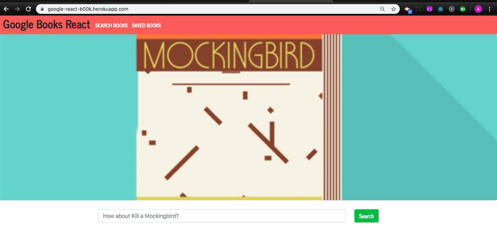

# Google Books React

 

## Description

Google Books React is a reading list app that takes a search term from the user and collects data from the Google Books API. Results are displayed on the page with a thumnail and relevant information. Buttons on each result allow the user to save the book information to be displayed on the saved page. Any combination of search results and users can add/view the saved results.

 

## Run Instructions

The user begins at the search page:

When the user searches a term:

When the user chooses the saved books option at the top of the page the results of any saves from any search that has not been deleted is displayed in the same fashion as the search results.

## This App Utilizes

- [Mongo DB/Mongoose](https://www.npmjs.com/package/mongoose)

- [Express](https://www.npmjs.com/package/express)

- [ReactJS](https://reactjs.org/)

- [Node JS](https://nodejs.org/en/)

 

## Role in Development

My name is Alex I am a bootcamp student whose portfolio can be found
[here](https://alexsamalot19.github.io/Samalot-Alexander-Portfolio/).

I created React components, worked with helper/util functions, and utilized React lifecycle methods to query and display books based on user searches. Node, Express and MongoDB were used so that users can save books to review or purchase later. The site is deployed to Heroku [here](https://google-react-b00k.herokuapp.com/).
